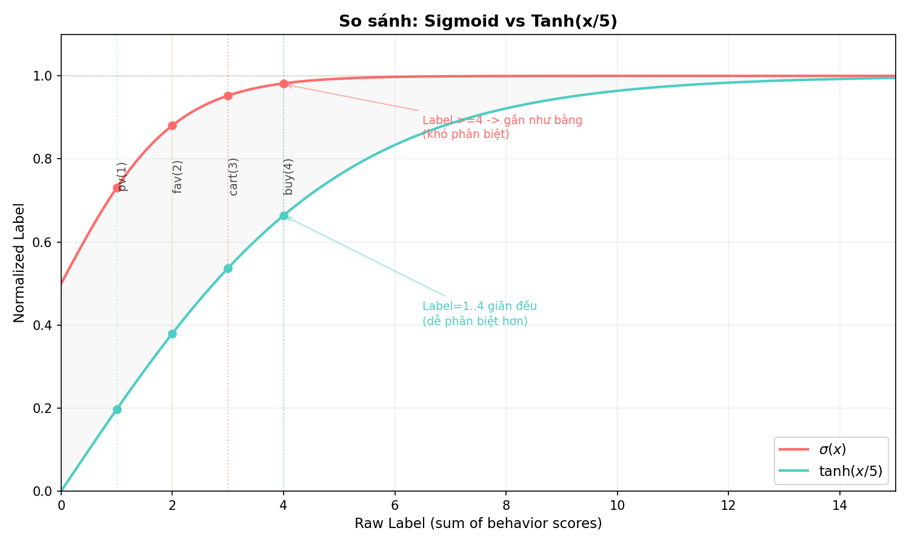
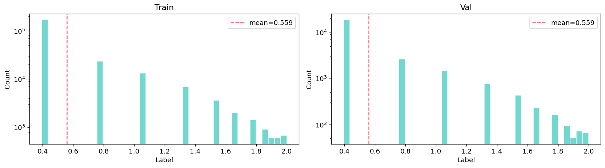
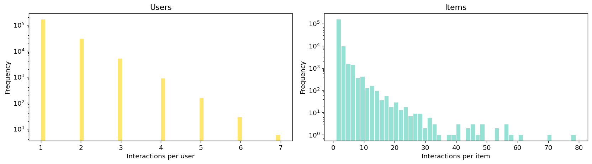

# DOCS — Train Model Data Pipeline

## 1. Tổng quan

Project xây dựng pipeline xử lý dữ liệu hành vi người dùng (UserBehavior từ Taobao) thành bộ dữ liệu train/val cho các mô hình recommendation (DeepFM, NeuMF, ...).

**Luồng dữ liệu tổng quát:**

```
Kaggle (raw CSV)
  → data/raw/UserBehavior.csv  (100M dòng)
  → data/preprocess/build.py    (xử lý)
  → data/processs/train.csv     (225K dòng)
  → data/processs/val.csv       (25K dòng)
```

---

## 2. Cấu trúc thư mục

```
data/
├── DOCS.md                  # Tài liệu này
├── raw/
│   └── UserBehavior.csv     # Raw data gốc 100M dòng (3.5GB)
├── preprocess/               # Code xử lý
│   ├── __init__.py
│   ├── config.py            # Cấu hình (paths, params)
│   ├── build.py             # Pipeline chính
│   ├── eda.py               # EDA (đọc từ output của build)
│   ├── charts.py            # Vẽ biểu đồ so sánh normalize
│   ├── load_data.py          # Download từ Kaggle
│   ├── utils.py             # Helper (timer, ensure_dir)
│   └── README.md
└── processs/                # Output của build
    ├── train.csv            # Training set (quá khứ)
    ├── val.csv              # Validation set (tương lai)
    ├── metadata.json        # Thông số của lần build gần nhất
    └── eda/                 # Biểu đồ EDA
        ├── label_distribution.png
        ├── normalize_comparison.png
        └── user_item_stats.png
```

---

## 3. Pipeline chi tiết (build.py)

### 3.1. Các bước

```
Step 1:  Load        — Đọc 100M dòng từ data/raw/UserBehavior.csv
Step 2:  Clean       — Xoá duplicate + lọc timestamp
Step 3:  Score       — Gán điểm behavior (pv=1, fav=2, cart=3, buy=4)
Step 4:  Groupby     — Gom (user, item) → sum Label, max Timestamp
Step 4b: Sample      — Stratified theo khung 4h (rải đều thời gian)
Step 4c: Normalize   — tanh(Label_raw / 5) → (0, 1)
Step 5:  Split       — Temporal 90/10 (quá khứ → train, tương lai → val)
Step 6:  Save        — Ghi train.csv + val.csv
Step 7:  Metadata    — Ghi metadata.json
```

### 3.2. Giải thích từng bước

#### Step 1 — Load
```python
df = pd.read_csv(RAW_DATA, names=COLUMNS, dtype=DTYPES)
```
Đọc file CSV với schema:
| Cột | Kiểu | Mô tả |
|---|---|---|
| user_id | int32 | ID user |
| item_id | int32 | ID item |
| category_id | int32 | ID danh mục |
| behavior | category | pv / fav / cart / buy |
| timestamp | int32 | Unix timestamp |

#### Step 2 — Clean
- `drop_duplicates()`: Xoá dòng trùng lặp (thường rất ít)
- `timestamp.between(TIMESTAMP_RANGE)`: Giữ các dòng trong khoảng thời gian cấu hình

#### Step 3 — Score behavior
```python
score_map = {"pv": 1, "fav": 2, "cart": 3, "buy": 4}
df["label"] = df["behavior"].map(score_map)
```
Chuyển behavior thành điểm số theo thang đo mức độ tương tác:
- **pv** (xem) = 1 — tương tác nhẹ nhất
- **fav** (thích) = 2 — quan tâm
- **cart** (giỏ hàng) = 3 — có ý định mua
- **buy** (mua) = 4 — chốt đơn

Ý tưởng: càng gần mua thì điểm càng cao, tạo ra Label có tính thứ bậc.

#### Step 4 — Group by (user, item)
```python
g = df.groupby(["user_id", "item_id"], as_index=False)
df = g.agg(Timestamp=("timestamp", "max"), Label=("label", "sum"))
```
Gom các behavior của cùng 1 user với **cùng 1 item**:
- `Label` = tổng điểm các behavior (vd: pv(1)+fav(2)+cart(3)+buy(4) = **10**)
- `Timestamp` = thời điểm xảy ra behavior **cuối cùng** (max)

Giảm từ 99M dòng raw → 75M cặp (user, item).

**Ví dụ:**
```
Raw (5 dòng):
UserA, ItemX, pv,  t=100
UserA, ItemX, fav, t=200
UserA, ItemX, cart, t=300
UserA, ItemX, buy, t=400
UserA, ItemY, pv,  t=500

Sau groupby (2 dòng):
UserA, ItemX, Timestamp=400, Label=1+2+3+4=10
UserA, ItemY, Timestamp=500, Label=1
```

#### Step 4b — Stratified sample by hour
```python
df["_hour_bin"] = df["Timestamp"] // (HOUR_BIN_SIZE * 3600)  # 4h buckets
freq = df["_hour_bin"].value_counts(normalize=True)
samples_per_bin = (freq * n_rows).round().astype(int)
```

Thay vì lấy top-N dòng gần nhất (chỉ được 8 tiếng cuối), ta **rải đều mẫu** theo khung 4h:
- Chia timestamp thành các bucket 4h
- Mỗi bucket lấy số dòng tỉ lệ với dung lượng của nó
- Kết quả: data trải dài **~209 tiếng (9 ngày)** thay vì chỉ 8 tiếng

Chỉ chạy khi `--rows` được truyền vào. Nếu không, giữ toàn bộ dữ liệu.

#### Step 4c — Normalize Label to (0, 1)
```python
df["Label"] = np.tanh(df["Label"] / 5.0)
```

**Vấn đề:** Label gốc là tổng score (1..208). Phân bố rất lệch, cần đưa về khoảng chuẩn cho model học.

**Tại sao `tanh(x/5)` thay vì `2*tanh(x/5)` (v1)?**

| | v1: 2·tanh(x/5) | v2: tanh(x/5) |
|---|---|---|
| **Range** | (0, 2) | **(0, 1)** |
| **BCE Loss** | ❌ Sai — BCE yêu cầu [0, 1] | ✅ Đúng |
| **Giãn label** | Giãn đều label 1-4 | Giãn đều label 1-4 |

Bỏ hệ số 2, giữ nguyên ưu điểm giãn đều, đưa label về range hợp lệ cho BCE.

| Label raw | tanh(x/5) |
|---|---|
| 1 (pv) | **0.197** |
| 2 (fav) | **0.380** |
| 3 (cart) | **0.537** |
| 4 (buy) | **0.665** |
| 10 (full) | **0.964** |



#### Step 5 — Temporal split (quá khứ / tương lai)
```python
df = df.sort_values("Timestamp")
cutoff = df["Timestamp"].quantile(TRAIN_RATIO)  # 90%
train = df[df["Timestamp"] <= cutoff]
val = df[df["Timestamp"] > cutoff]
```

**Tại sao temporal thay vì user-holdout (v1)?**

| | v1: User-holdout 90/10 | v2: Temporal 90/10 |
|---|---|---|
| **Train** | 90% users (random) | 90% data cũ nhất (quá khứ) |
| **Val** | 10% users (random) | 10% data mới nhất (tương lai) |
| **Val users** | 100% cold-start | ~25% đã có trong train |
| **Ý nghĩa** | Đánh giá user mới | Dự đoán hành vi tương lai |
| **Tỉ lệ** | 90/10 | 90/10 |

Temporal split đánh giá đúng bài toán recommendation: **dựa vào quá khứ, dự đoán khả năng mua trong tương lai**.

- Train chứa tất cả interactions trước mốc thời gian (90th percentile)
- Val chứa tất cả interactions sau mốc đó
- User có thể xuất hiện ở cả train và val → model đã học embedding

---

## 4. EDA — Đọc và hiểu biểu đồ

### 4.1. Label Distribution



**Cách đọc:**
- Trục X: Label sau normalize (0..1)
- Trục Y: Số lượng mẫu (log scale)
- Đường đứt: Giá trị trung bình

**Ý nghĩa:**
- ~76% dữ liệu ở bin 0.10-0.20 (chỉ pv)
- Phân bố lệch trái mạnh → model có xu hướng predict thấp
- Train vs Val: phân bố tương tự (mean 0.276 vs 0.314)

### 4.2. User & Item Statistics



**Cách đọc:**
- Biểu đồ trái: Phân phối số lượng item mỗi user tương tác
- Biểu đồ phải: Phân phối số lượng user mỗi item có

**Ý nghĩa:**
- Đa số user chỉ tương tác với **1 item** → cold-start là vấn đề chính
- Đa số item chỉ được **1 user** tương tác → item embedding khó học
- Sparsity: **99.999%** (ma trận user-item cực thưa)

### 4.3. Normalize Comparison


**Cách đọc:**
- Đường đỏ: `2 * sigmoid(x)` — bão hoà nhanh, label ≥4 gần như bằng nhau
- Đường xanh: `2 * tanh(x/5)` — dãn đều hơn
- Pipeline v2 dùng `tanh(x/5)` (không nhân 2) để range (0, 1) thay vì (0, 2)

---

## 5. So sánh v1 → v2

| Bước | v1 (cũ) | v2 (mới) | Lý do |
|---|---|---|---|
| **Normalize** | 2·tanh(x/5) → (0, 2) | tanh(x/5) → (0, 1) | BCE cần label ∈ [0, 1] |
| **Split** | User-holdout 90/10 | Temporal 90/10 | Dự đoán tương lai, tránh cold-start |

Các bước khác giữ nguyên.

---

## 6. Cách chạy

```bash
# 1. Download dữ liệu (nếu chưa có)
python -m data.preprocess.load_data

# 2. Build pipeline
python -m data.preprocess.build --rows 250000

# 3. EDA
python -m data.preprocess.eda

# 4. Charts
python -m data.preprocess.charts
```

### Tham số `--rows`

| Giá trị | Số dòng output | Mục đích |
|---|---|---|
| 250000 | 250K | Phát triển, test nhanh |
| 500000 | 500K | Train thật (cần GPU mạnh) |
| (bỏ qua) | 75M (full) | Toàn bộ dữ liệu |

---

## 7. Kiến trúc output (train.csv / val.csv)

| Cột | Kiểu | Ví dụ | Mô tả |
|---|---|---|---|
| UserId | int32 | 1 | ID user gốc (không encode) |
| ItemId | int32 | 2268318 | ID item gốc (không encode) |
| Timestamp | int32 | 1512345600 | Thời điểm tương tác cuối (max) |
| Label | float32 | 0.1974 | Score đã normalize: tanh(sum_scores/5) |

**train.csv:** 90% data cũ nhất — quá khứ.

**val.csv:** 10% data mới nhất — tương lai. Dùng để đánh giá khả năng dự đoán hành vi mua sắm trong tương lai.

---

## 8. File metadata.json

```json
{
  "n_rows_take": 250000,
  "n_rows_raw": 100150807,
  "n_rows_clean": 250000,
  "n_train": 225000,
  "n_val": 25000,
  "n_users": 205727,
  "n_items": 175343,
  "n_train_users": 187767,
  "n_val_users": 24087,
  "hour_bin_size": 4,
  "sampling": "stratified_by_hour",
  "split": "temporal",
  "train_ratio": 0.9,
  "label_raw_range": [1, 46],
  "label_norm": "tanh(x/5) -> (0, 1)",
  "label_percentiles": {
    "1%": 0.1974, "50%": 0.1974,
    "75%": 0.1974, "90%": 0.5370, "99%": 0.9217
  },
  "timestamp_span_hours": 209,
  "random_seed": 42,
  "columns": ["UserId", "ItemId", "Timestamp", "Label"]
}
```

| Field | Ý nghĩa |
|---|---|
| n_rows_take | Số dòng yêu cầu (--rows) |
| n_rows_raw | Số dòng raw gốc |
| n_rows_clean | Số dòng output thực tế |
| n_train / n_val | Số dòng train/val |
| n_users / n_items | User/item unique |
| sampling | Phương pháp sampling |
| split | Phương pháp split: temporal |
| train_ratio | Tỉ lệ train (0.9) |
| label_percentiles | Phân phối Label |
| timestamp_span_hours | Khoảng thời gian (giờ) |

---

*Generated by train-model preprocess pipeline v2.*
