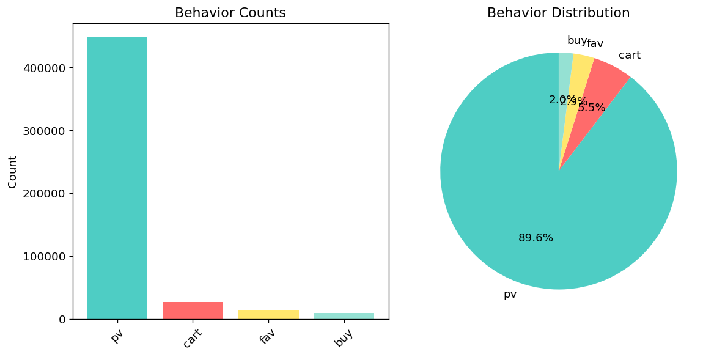
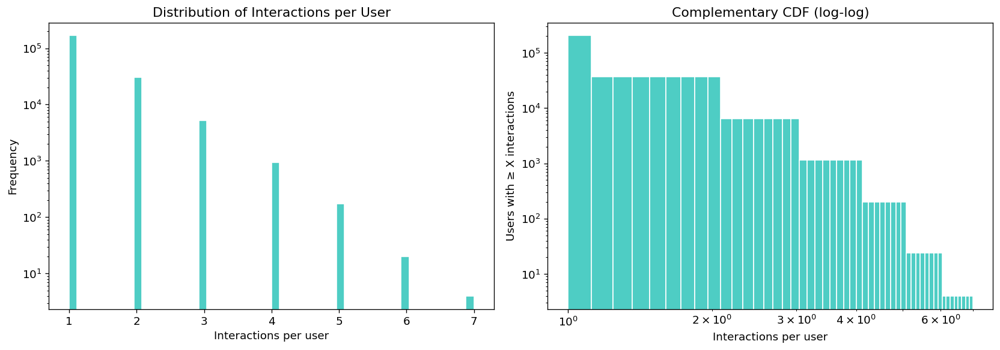
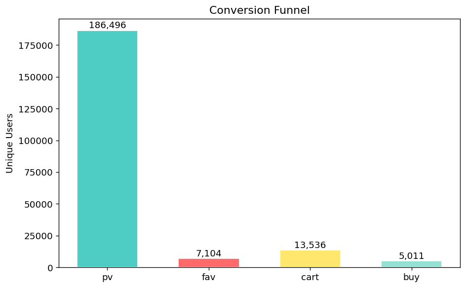

# Preprocess

Pipeline chuyển raw `UserBehavior.csv` → `train.csv` + `val.csv`.

## Output

Mỗi file chỉ có **4 cột**:

| Cột | Gốc | Mô tả |
|---|---|---|
| `UserId` | `user_id` | ID người dùng |
| `ItemId` | `item_id` | ID sản phẩm |
| `Timestamp` | `timestamp` | Thời điểm tương tác cuối (max) |
| `Label` | `behavior` | Tổng điểm: pv=1 + fav=2 + cart=3 + buy=4 |

Mỗi dòng là 1 cặp `(user, item)` — gộp các behavior của user đó với item đó lại, **Label = sum(score)**. Timestamp lấy giá trị lớn nhất (gần đây nhất).

## Pipeline

```
Load → Dedup + filter timestamp → Tạo Label → Chọn 4 cột + Split → Save
```

Không feature engineering, không encode, không cumulative features. Split trước khi làm augmentation.

## Chạy

```bash
python -m preprocess.build
```

Output lưu ở `data/processs/`.

## EDA

```bash
python -m preprocess.eda
```

Biểu đồ lưu ở `data/processs/eda/`:

| Biểu đồ | Mô tả |
|---|---|
|  | Phân phối behaviors |
|  | Interactions/user |
|  | Conversion pv → fav → cart → buy |
